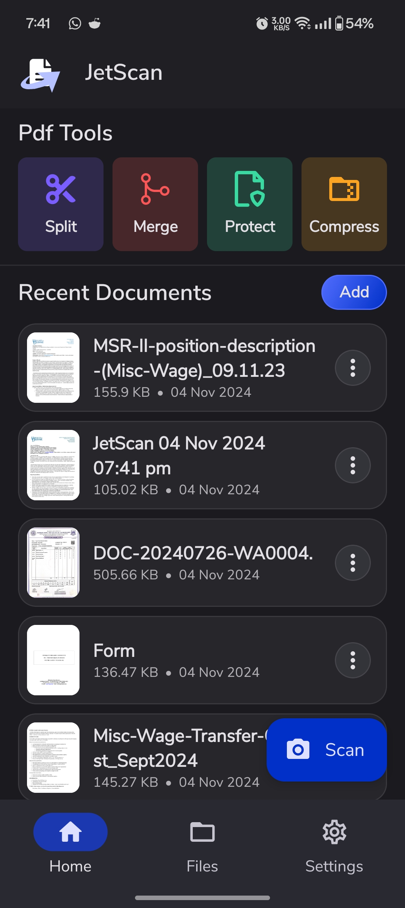

<p align="center">
  <a href=""></a>
</p>
<h1 align="center">JetScan</h1>

JetScan is an android application that allows you to scan and save documents with ease and speed. With Features like auto edge detection, auto crop, and auto enhance, you can scan documents with just a few taps. (The app is still in development and needs more improvements 🚧)

## 🛠️ Compatibility

- **Java**: 17
- **Gradle**: 8.7
- **Kotlin**: 1.9.0
- **Android SDK**: Min 23, Target 31
- **Platform Support**: Android
- **Orientation**: Portrait, Landscape

## 🏗️ Architecture

JetScan is built using MVVM architecture with Repository pattern. The project is divided into 3 main modules:

- `app`: Contains the data and presentation logic.
- `opencv`: Contains the OpenCV library and JNI bindings.
- `pdf`: Contains the PDF generation logic.

To know more on the architecture and how new screens are constructed, refer to the [Architecture](docs/Architecture.md) document.

## 📱 Preview Screens

### Auth Screens

| Login                                          | Register                                          |
| ---------------------------------------------- | ------------------------------------------------- |
|  |  |

### Home Screens

| Home                                          | Scan                                              |
| --------------------------------------------- | ------------------------------------------------- |
|  |  |

### Scanner Screens

| Scanner                                               | Preview                                              |
| ----------------------------------------------------- | ---------------------------------------------------- |
|  |  |

In order to view more screens in details, visit the [Screens](docs/Preview.md) document.

## 🚀 Setup

In order to setup the project, please check with the Compatibility section and ensure you have the required tools installed. The project is dependent on **Firebase** for authentication and OCR.

### 1. Clone the repository

```bash
git clone https://github.com/JetScan-Technologies/jetscan-android
```

### 2. Open the project in Android Studio.

Authenication currently uses **Firebase Auth**. To setup Firebase Auth, follow the steps below:

1. Go to the [Firebase Console](https://console.firebase.google.com/).
2. Create a new project.
3. Add an Android app to the project.
4. Enable Email/Password in authentication in the Firebase Console.
5. Download the `google-services.json` file and place it in the `app` directory.

The App also uses **Google Sign-In**. To setup Google Sign-In, follow the steps below:

1. Go the Firebase project settings and enable Google Sign-In.
2. Generate a SHA-1 key using the following command:

```bash
gradlew signingReport
```

3. Add the SHA-1 key to the Firebase Console.
4. Redownload the `google-services.json` file and place it in the `app` directory.
5. Additionally, add `GOOGLE_CLIENT_ID` in the `local.properties` file.

### 4. Add supporting features (Optional).

#### OCR Functionality

To use the OCR functionality, you need to add a service account to the Firebase project. Follow the steps below:

1. Go to the Firebase Console and create a new service account.
2. Add `Document AI Adminstrator` role to the service account.
3. Download the service account key and place it in the `app` directory and rename to `service-account.json`.
4. Create a processor in the Document AI console and get the processor endpoint
5. Seperate the base URL and endpoint and add it to the `local.properties` file in following way.

```properties
GCP_DOCUMENT_AI_BASE_URL=<base-url>
GCP_DOCUMENT_AI_ENDPOINT=<endpoint>
```

#### Backend Functionality

To use pdf tools features, you need to add a backend url to `local.properties`.

```properties
JETSCAN_BACKEND_URL=<backend-url>
```

Currently, the backend is not open sourced and is in development but the release app works properly.

### 5. Build and run the project.

Use the following command to build and run the project:

```bash
gradlew assembleDebug
```

The debug version of the app will be installed on the device.

#### Build a release version

To build a release version of the app, follow the steps below:

1. Create a new keystore file using the following command:

```bash
keytool -genkey -v -keystore release-keystore -alias <alias-here> -keyalg RSA -keysize 2048 -validity 10000
```

2. Place the keystore file in the **root** directory of the project.
3. Generate the SHA-1 key using the following command:

```bash
keytool -list -v -keystore release-keystore -alias <alias-here>
```

4. Add the SHA-1 key to the Firebase Console and update the `google-services.json` file.

5. Make a new file named `key.properties` in the `app` directory.
6. Add the following properties to the `key.properties` file:

```properties
storePassword=<store-password>
keyPassword=<key-password>
keyAlias=<key-alias>
storeFile=<keystore-file>
```

7. Build the release version using the following command:

```bash
gradlew assembleRelease
```

As of now, the app doesn't relies only on Firebase for Auth and Crashlytics. It doesn't have any linting or testing setup.

## 👏 Contributing

JetScan is an open source project and is open to contributions. If you have any suggestions or improvements, feel free to create a pull request. If you encounter any issues, please create an issue in the repository.

### Features to be added

1. Add more document edit features like watermark, signature, text addition etc.
2. Fix import pdf view and add more pdf features.
3. Optimize the document recognition to work on all types of documents.
4. More settings and a subscription model for the app.
5. Translation and localization of the app.
6. Add hints when user is first time using the app.

## 📝 License

This project is licensed under the MIT License - see the [LICENSE](LICENSE.txt) file for details.

## 📧 Contact

For any queries or suggestions, feel free to reach out to at [Email](mailto:info.jetscan@gmail.com)
